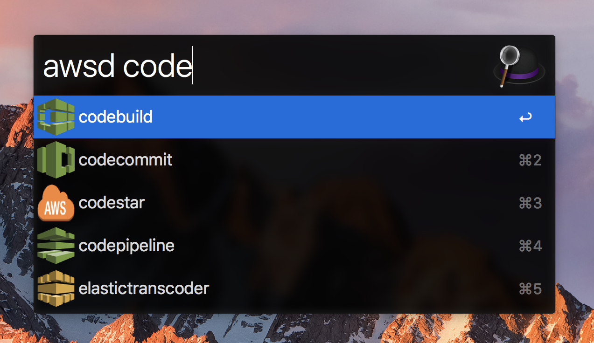

# alfred-worklflow-awsclidoc

Alfred workflow for looking up awscli command web documentation. Uses the excellent [alfred-workflow](https://github.com/deanishe/alfred-workflow) library and icons from [AWS Simple Icons](https://aws.amazon.com/architecture/icons/). The project also makes use of [awp](https://github.com/caleb531/alfred-workflow-packager) in the release workflow.

# Prequisites

You must have awscli installed since this workflow makes use of it for working out available commands.

# Usage

